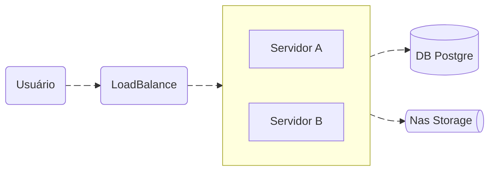

# Ahtlas — Backend

O Ahtlas é uma plataforma corporativa de gestão interna que desenvolvi entre 2021 e 2025. Ela reúne, em uma única aplicação web, módulos de indicadores, remuneração variável, acompanhamento de equipes, relatórios e rotinas operacionais.

Este repositório tem a API em Laravel. O frontend (Vue 3 + Vuetify 3) está no repositório `ahtlas-frontend`.

> **Sobre este repositório:** este código foi adaptado de um sistema real, usado em produção por uma empresa. Ele está publicado apenas para mostrar a qualidade do meu código: organização, padrões e decisões técnicas. Não foi preparado para ser executado. Nomes de empresas, matrículas, endpoints, credenciais, marcas e dados de pessoas foram removidos ou trocados por valores fictícios, e as integrações dependem de sistemas externos que não fazem parte do código.

## Stack

| Camada | Tecnologias |
|---|---|
| Linguagem / framework | PHP 8.3, Laravel 11 |
| Autenticação | Laravel Sanctum (sessão + token), provedores externos via HTTP |
| Bancos de dados | PostgreSQL (principal), Oracle (`yajra/laravel-oci8`), SQL Server, MongoDB (`mongodb/laravel-mongodb`) |
| Filas e agendamento | Laravel Queue (driver `database`), Laravel Scheduler |
| PDF e imagens | Dompdf, FPDF/FPDI, Intervention Image |
| Observabilidade | Laravel Pulse, log de acessos e de autenticação em tabela |
| Infraestrutura | Apache 2 em RedHat 9, dois servidores atrás de um balanceador de carga, Supervisor para filas e agendador |

## Arquitetura

O balanceador distribui as requisições entre dois servidores gêmeos, que hospedam backend e frontend. O SSL termina no balanceador. Os arquivos gerados (relatórios, termos, cargas) ficam em um storage de rede. Mais detalhes estão em [documentation/arquitetura.md](documentation/arquitetura.md).

## Organização do código

O código é dividido em três áreas, que se repetem em controllers, models, comandos, migrations e rotas:

- **Core**: autenticação, usuários, permissões, menus, notificações e logs (`app/Services/Core`, `routes/modules/Core.php`).
- **Modules**: áreas de negócio (`Administration`, `Management`, `TacticalCenter`, `People`, `ForMe`), cada uma com controllers, services, models e arquivo de rotas próprios em `routes/modules/`.
- **Addons**: integrações e cargas auxiliares, como o assistente virtual, cadastro de usuários externos, ocupação de posições de atendimento e cargas de KPI, headcount e calendário.

A regra de negócio fica na **camada de serviços** (`app/Services/{Core,Modules}`). Os controllers recebem a requisição e delegam aos serviços. Constantes de domínio (status, cores, grupos) ficam em interfaces ao lado de cada serviço (ex.: `TermInterface`, `ReportInterface`). As respostas da API seguem um formato padronizado, definido pelo trait `ApiResponser`.

As migrations são separadas por schema/conexão (`database/migrations/{core,modules,addons}` e `database/migrations/modules/<Módulo>`) e registradas no `AppServiceProvider`.

## Destaques técnicos

### Autenticação com múltiplos provedores
`AuthService::login` identifica o tipo de usuário pelo prefixo da matrícula (`AuthInterface::TYPES`) e tenta, nesta ordem:
1. autenticação local (`authLocal`);
2. IdP corporativo via HTTP (`authCorporateIdp`), para matrículas `usr`;
3. diretório LDAP do cliente (`authLdap`), para matrículas `ext`. Usuários desse tipo são criados automaticamente no primeiro acesso (`createLdapUser`).

Depois do login, as outras sessões do usuário são encerradas e um token Sanctum é emitido. Toda tentativa de login é gravada em `log_auths`.

### Controle de acesso por rota com regras hierárquicas
O middleware [`RoutePermission`](app/Http/Middleware/RoutePermission.php) protege todas as rotas autenticadas. Ele pega o prefixo estático da rota e o compara com as rotas liberadas para o usuário. Essas rotas são calculadas a partir das regras em `core.route_permissions`, que podem combinar matrícula, setor, gestores de nível 1 a 5, nível hierárquico, cargo, UF e tipo de usuário. Administradores (`core.user_admins`) passam direto. Cada acesso fica registrado em `log_accesses`. A documentação completa está em [documentation/auth.md](documentation/auth.md).

### Termos de remuneração variável (RV)
O módulo `Administration/Incentives/RV` cobre o ciclo completo de um termo:
- **criação e versionamento**: cada alteração gera uma nova versão (`TermService::getNewVersion`) e cancela as anteriores (`cancelOldVersion`). Também é possível copiar um termo;
- **aprovação**: status Standby → Pendente → Aprovado/Reprovado/Cancelado, com aprovação feita por rotina (`rv:approve`);
- **assinatura**: distribuição dos termos aos colaboradores por job em fila (`TermEmployeeToSignJob`) e assinatura na área "Para mim";
- **apuração**: cálculo dos resultados a partir dos KPIs (`rv:evaluation`), com encerramento mensal (`rv:evaluation-stop`);
- **PDF**: geração dos termos e das assinaturas com Dompdf e FPDI a partir de templates Blade (`resources/views/templates/rv`).

### Rotinas agendadas, filas e cargas de dados
O agendamento fica em [routes/console.php](routes/console.php). Ele encadeia a atualização diária de usuários e da estrutura de equipes, as cargas de KPIs por colaborador e setor, as rotinas de RV e da Central de Controle, o portal de trocas de horário e a atualização de avatares. Os processos pesados (e-mails da Central de Controle, distribuição de termos, carga de arquivos de planejamento) rodam em jobs enfileirados, mantidos pelo Supervisor.

### Integração com vários bancos
Cada fonte de dados tem sua conexão: PostgreSQL com schemas `core`, `modules` e `addons` para os dados da aplicação; Oracle para a base de RH e uma base analítica; SQL Server para bases de MIS e portal; MongoDB. Os comandos de carga leem das bases de origem e gravam no PostgreSQL.

## Execução

O projeto não roda como está: ele depende das bases de dados e dos serviços do cliente (IdP corporativo, diretório LDAP, bases de RH e MIS), que não fazem parte do código. O [.env.example](.env.example) fica apenas como referência das configurações e integrações que a aplicação usa.

## Licença

Código publicado apenas como portfólio.
