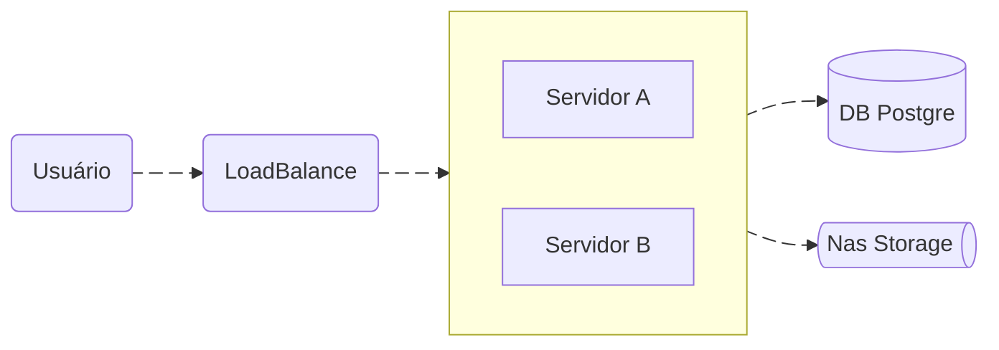

# Arquitetura



## Loadbalance

Faz o balanceamento de carga entre os servidores A e B conforme disponibilidade dos servidores. Certificado SSL (HTTPS) são configurados nessa camada.

## Servidores A e B

Camada Web da aplicação: Composta por 2 servidores gêmeos que hospedam tanto o backend quanto o frontend, que se comunicam com endereços distintos e API JSON.

```
Apache 2
RedHat 9
```

## Backend

```
PHP 8.3
Laravel 11
```

## Frontend

```
Vue.js 3
Vuetify 3
```